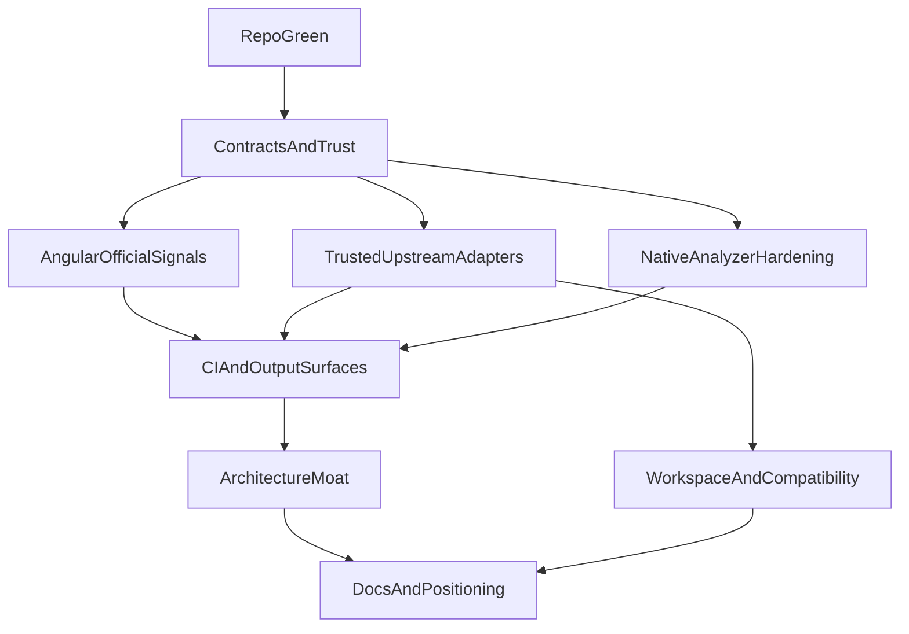

# ng-xray Master Plan

## Goal

Turn ng-xray into a credible candidate for the default Angular repo-health standard by combining two things that are both required:

- fix the repo’s current trust and contract problems
- deliver the missing product tracks the broader strategy depends on

This replaces the narrower overhaul plan with a fuller master plan.

## Product Direction

Use a balanced strategy:

- Preserve a useful `npx ng-xray` first run for discovery and low-friction adoption.
- Prefer project-owned Angular, ESLint, and Knip integrations whenever they exist, because that is the only long-term trustworthy CI path.
- Treat built-in analysis as explicit fallback or additive guidance, never as a silent substitute for a broken upstream setup.

Decision rule:

- Missing upstream tooling/config: fallback is allowed and clearly labeled.
- Broken upstream tooling/config: analyzer fails and scan becomes `partial`.

## Scope Model

### Core v1

Core v1 is the minimum product that can plausibly be called production-credible.

Includes:

- repo and CI credibility
- stable finding contract
- Angular Extended Diagnostics ingestion
- ESLint ingestion
- Knip-backed dead-code path
- honest stable vs experimental handling
- HTML, JSON, SARIF, and CI gating
- workspace support and compatibility testing

### V1.x Expansion

V1.x is where the differentiation gets stronger after trust is earned.

Includes:

- architecture rules engine MVP
- architecture presets
- richer PR/report polish
- compatibility and workspace analyzers as first-class features

### Later Bets

Keep out of the critical path unless capacity expands.

Includes:

- VS Code companion
- advanced rule catalog and suppression UX
- hosted/reporting surfaces
- broader security ambitions

## Delivery Map



## Phase 0: Repo Credibility First

Goal: make the project pass its own bar before expanding product scope.

Key targets:

- [package.json](/Users/n.tamir/Documents/programming/ng-xray/package.json)
- [.github/workflows/ci.yml](/Users/n.tamir/Documents/programming/ng-xray/.github/workflows/ci.yml)
- [packages/ng-xray/tsconfig.json](/Users/n.tamir/Documents/programming/ng-xray/packages/ng-xray/tsconfig.json)
- [packages/ng-xray/src/types.ts](/Users/n.tamir/Documents/programming/ng-xray/packages/ng-xray/src/types.ts)
- [packages/ng-xray/src/cli.ts](/Users/n.tamir/Documents/programming/ng-xray/packages/ng-xray/src/cli.ts)
- [packages/ng-xray/src/scan.ts](/Users/n.tamir/Documents/programming/ng-xray/packages/ng-xray/src/scan.ts)
- [packages/ng-xray/src/watch.ts](/Users/n.tamir/Documents/programming/ng-xray/packages/ng-xray/src/watch.ts)

Work:

- Make root CI commands real. Either add a root `typecheck` script or stop calling it from CI.
- Fix the duplicate `architecture` config contract in `types.ts`.
- Decide fixture strategy: exclude `src/__fixtures__` from package typecheck or make them intentionally compilable with local stubs.
- Implement or remove `--diff`; do not keep dead CLI promises.
- Replace hand-rolled glob filtering in `scan.ts` with `picomatch`.
- Sort `diagnostics` and `analyzerRuns` deterministically before returning `ScanResult`.
- Make watch-mode repo-shape behavior consistent with scan-mode support.
- Add the first end-to-end `scan()` integration fixture before larger refactors.

Exit criteria:

- repo scripts and CI match
- package `typecheck` passes
- no contradictory config types remain
- no dead public flag remains
- at least one end-to-end scan test exists

## Phase 1: Shared Contracts And Failure Semantics

Goal: every output should be able to explain what a finding is, where it came from, and whether the scan can be trusted.

Key targets:

- [packages/ng-xray/src/types.ts](/Users/n.tamir/Documents/programming/ng-xray/packages/ng-xray/src/types.ts)
- [packages/ng-xray/src/constants.ts](/Users/n.tamir/Documents/programming/ng-xray/packages/ng-xray/src/constants.ts)
- [packages/ng-xray/src/scan.ts](/Users/n.tamir/Documents/programming/ng-xray/packages/ng-xray/src/scan.ts)
- [packages/ng-xray/src/scoring/calculate-score.ts](/Users/n.tamir/Documents/programming/ng-xray/packages/ng-xray/src/scoring/calculate-score.ts)
- [packages/ng-xray/src/report/terminal.ts](/Users/n.tamir/Documents/programming/ng-xray/packages/ng-xray/src/report/terminal.ts)
- [packages/ng-xray/src/report/html.ts](/Users/n.tamir/Documents/programming/ng-xray/packages/ng-xray/src/report/html.ts)

Contract additions:

```ts
export type DiagnosticSource = 'angular' | 'angular-eslint' | 'knip' | 'ng-xray';
export type DiagnosticStability = 'stable' | 'experimental';

interface Diagnostic {
  source: DiagnosticSource;
  stability: DiagnosticStability;
}
```

Work:

- Add `source` and `stability` to `Diagnostic`.
- Add `source` to `AnalyzerRunInfo` where meaningful.
- Ensure all analyzers set provenance explicitly.
- Make analyzer status, failure reasons, and skip reasons explicit in `ScanResult` and all outputs.
- Downweight experimental findings in score calculation.
- Fix remediation impact estimation to follow the same score model.
- Document partial-scan meaning in terminal, HTML, JSON, and later SARIF.

Exit criteria:

- provenance exists in JSON
- terminal and HTML display source and stability
- partial-scan truth is visible everywhere
- score methodology matches implementation

## Phase 2: Official Angular Signal Ingestion

Goal: add the highest-trust framework-native signal as a first-class input.

Key targets:

- new Angular integration analyzer under [packages/ng-xray/src/analyzers/](/Users/n.tamir/Documents/programming/ng-xray/packages/ng-xray/src/analyzers)
- [packages/ng-xray/src/scan.ts](/Users/n.tamir/Documents/programming/ng-xray/packages/ng-xray/src/scan.ts)
- [packages/ng-xray/src/types.ts](/Users/n.tamir/Documents/programming/ng-xray/packages/ng-xray/src/types.ts)
- [packages/ng-xray/src/report/html.ts](/Users/n.tamir/Documents/programming/ng-xray/packages/ng-xray/src/report/html.ts)
- [packages/ng-xray/src/report/terminal.ts](/Users/n.tamir/Documents/programming/ng-xray/packages/ng-xray/src/report/terminal.ts)

Work:

- Add an analyzer that ingests Angular Extended Diagnostics.
- Preserve official diagnostic codes and wording where practical.
- Normalize findings to `source: 'angular'` and `stability: 'stable'`.
- Add dedupe policy where native/ng-xray rules overlap with official Angular signals.
- Ensure Angular integration failures are explicit and produce partial-scan semantics, not silent omission.

Exit criteria:

- Angular-sourced findings appear in terminal, HTML, and JSON
- analyzer summary includes Angular adapter status and duration
- overlapping findings have a documented dedupe rule

## Phase 3: Trusted Upstream Adapters

Goal: make ng-xray an orchestration layer first, not a competing replacement.

Key targets:

- [packages/ng-xray/src/analyzers/lint.ts](/Users/n.tamir/Documents/programming/ng-xray/packages/ng-xray/src/analyzers/lint.ts)
- [packages/ng-xray/src/analyzers/dead-code.ts](/Users/n.tamir/Documents/programming/ng-xray/packages/ng-xray/src/analyzers/dead-code.ts)
- [packages/ng-xray/src/utils/load-config.ts](/Users/n.tamir/Documents/programming/ng-xray/packages/ng-xray/src/utils/load-config.ts)
- [packages/ng-xray/src/scan.ts](/Users/n.tamir/Documents/programming/ng-xray/packages/ng-xray/src/scan.ts)

### Lint Track

- Support `ingest` mode using the repo’s ESLint configuration.
- Support `built-in` mode for fallback/demo usage.
- Detect when the repo has no ESLint config versus when it has a broken one.
- Broken ESLint setup must fail the analyzer, not silently route to built-in rules.

### Dead-Code Track

- Make Knip-backed findings the default trusted dead-code path.
- Prefer local Knip installs.
- Replace `execSync` with `execFileSync`.
- Keep ng-xray-native Angular dead-code heuristics separate and clearly experimental.

Exit criteria:

- lint and dead-code each have a trusted path and a labeled fallback path
- broken upstream toolchains do not appear healthy
- README accurately describes default behavior

## Phase 4: Native Analyzer Hardening

Goal: reduce false positives until stability labels are actually defensible.

Key targets:

- [packages/ng-xray/src/analyzers/best-practices.ts](/Users/n.tamir/Documents/programming/ng-xray/packages/ng-xray/src/analyzers/best-practices.ts)
- [packages/ng-xray/src/analyzers/lazy-loading.ts](/Users/n.tamir/Documents/programming/ng-xray/packages/ng-xray/src/analyzers/lazy-loading.ts)
- [packages/ng-xray/src/analyzers/dead-code-angular.ts](/Users/n.tamir/Documents/programming/ng-xray/packages/ng-xray/src/analyzers/dead-code-angular.ts)
- [packages/ng-xray/src/analyzers/security.ts](/Users/n.tamir/Documents/programming/ng-xray/packages/ng-xray/src/analyzers/security.ts)
- [packages/ng-xray/src/analyzers/architecture.ts](/Users/n.tamir/Documents/programming/ng-xray/packages/ng-xray/src/analyzers/architecture.ts)
- [packages/ng-xray/src/analyzers/circular-injection.ts](/Users/n.tamir/Documents/programming/ng-xray/packages/ng-xray/src/analyzers/circular-injection.ts)

Work:

- Move mutable `ts-morph` `Project` instances into analyzer execution scope.
- Tighten `prefer-inject` and async lifecycle checks so they only apply to Angular-managed classes.
- Re-evaluate lazy-loading rules and downgrade to experimental if they remain policy-heavy.
- Rewrite security detection to use AST/template parsing where feasible.
- Remove silent `return []` behavior from analyzers that should fail or skip explicitly.
- Expand negative tests for all high-risk analyzers.

Exit criteria:

- stable rules are defendable in CI conversations
- no analyzer silently degrades systemic failure into a clean pass
- high-noise analyzers have real negative coverage

## Phase 5: CI And Output Surfaces

Goal: add team-facing output surfaces only after the command contract is trustworthy.

Key targets:

- [packages/ng-xray/src/cli.ts](/Users/n.tamir/Documents/programming/ng-xray/packages/ng-xray/src/cli.ts)
- [packages/ng-xray/src/report/html.ts](/Users/n.tamir/Documents/programming/ng-xray/packages/ng-xray/src/report/html.ts)
- [packages/ng-xray/src/report/terminal.ts](/Users/n.tamir/Documents/programming/ng-xray/packages/ng-xray/src/report/terminal.ts)
- new files under [packages/ng-xray/src/report/](/Users/n.tamir/Documents/programming/ng-xray/packages/ng-xray/src/report)
- [.github/actions/ng-xray/action.yml](/Users/n.tamir/Documents/programming/ng-xray/.github/actions/ng-xray/action.yml)

Work:

- Always generate HTML reports and always print the path.
- Make `--open` only control browser launch.
- Add `--fail-under` with explicit precedence rules versus partial scans.
- Add SARIF output with provenance mapping.
- Add PR summary markdown output.
- Add an official GitHub Action once command contracts are stable.
- Keep JSON mode machine-pure.

Recommended exit-code policy:

- `1` fatal runtime/config error
- `2` partial scan
- `3` threshold failure on a complete scan
- document precedence if both partial and threshold conditions would apply

Exit criteria:

- HTML, JSON, SARIF, and PR summary agree on the same trust model
- CI can archive useful artifacts for healthy and unhealthy repos

## Phase 6: Architecture Moat

Goal: build the product track that makes ng-xray more than a wrapper.

Key targets:

- new architecture rule engine files under [packages/ng-xray/src/analyzers/](/Users/n.tamir/Documents/programming/ng-xray/packages/ng-xray/src/analyzers)
- [packages/ng-xray/src/types.ts](/Users/n.tamir/Documents/programming/ng-xray/packages/ng-xray/src/types.ts)
- [README.md](/Users/n.tamir/Documents/programming/ng-xray/README.md)
- docs under [/Users/n.tamir/Documents/programming/ng-xray/docs](/Users/n.tamir/Documents/programming/ng-xray/docs)

Work:

- Build an architecture rules engine MVP for Angular and non-Nx teams.
- Support import/boundary rules, public API restrictions, and deep-import constraints.
- Make rule authoring CI-safe and explicit.
- Add a small preset set for common Angular structures.
- Document what the engine does differently from Nx and generic ESLint boundary rules.

Exit criteria:

- architecture rules are configurable and testable
- at least one preset is viable for real teams
- this track is clearly differentiated and not just hand-wavy strategy

## Phase 7: Workspace Support And Compatibility

Goal: support real Angular repo shapes and prove the support with CI.

Key targets:

- [packages/ng-xray/src/detection/discover-project.ts](/Users/n.tamir/Documents/programming/ng-xray/packages/ng-xray/src/detection/discover-project.ts)
- [packages/ng-xray/src/scan.ts](/Users/n.tamir/Documents/programming/ng-xray/packages/ng-xray/src/scan.ts)
- [packages/ng-xray/src/cli.ts](/Users/n.tamir/Documents/programming/ng-xray/packages/ng-xray/src/cli.ts)
- [.github/workflows/ci.yml](/Users/n.tamir/Documents/programming/ng-xray/.github/workflows/ci.yml)
- [docs/compatibility.md](/Users/n.tamir/Documents/programming/ng-xray/docs/compatibility.md)

Work:

- Detect Angular workspaces intentionally.
- Add `--project <name>` and an explicit scan-all mode.
- Do not silently guess project selection rules without documentation.
- Add tarball/install integration tests against supported Angular majors and representative repo shapes.
- Publish compatibility docs only after CI evidence exists.

Exit criteria:

- workspace behavior is explicit
- compatibility claims are test-backed
- scan, watch, and outputs behave consistently across supported repo shapes

## Phase 8: Docs, Positioning, And Release Story

Goal: align the product narrative with what is actually shipped and proven.

Key targets:

- [README.md](/Users/n.tamir/Documents/programming/ng-xray/README.md)
- [docs/plans/2026-03-16-v1-roadmap-execution.md](/Users/n.tamir/Documents/programming/ng-xray/docs/plans/2026-03-16-v1-roadmap-execution.md)
- [docs/doc-pack-review/README.md](/Users/n.tamir/Documents/programming/ng-xray/docs/doc-pack-review/README.md)
- [docs/doc-pack-review/docs/product-strategy.md](/Users/n.tamir/Documents/programming/ng-xray/docs/doc-pack-review/docs/product-strategy.md)
- [docs/doc-pack-review/docs/v1-roadmap.md](/Users/n.tamir/Documents/programming/ng-xray/docs/doc-pack-review/docs/v1-roadmap.md)
- [docs/doc-pack-review/docs/backlog.md](/Users/n.tamir/Documents/programming/ng-xray/docs/doc-pack-review/docs/backlog.md)
- [docs/doc-pack-review/docs/rules-and-analyzers.md](/Users/n.tamir/Documents/programming/ng-xray/docs/doc-pack-review/docs/rules-and-analyzers.md)

Work:

- Reposition ng-xray as an Angular repo-health CLI/CI workflow first.
- Keep “platform” language as an earned future step, not a default headline.
- Split Core v1 and V1.x clearly in roadmap docs.
- Reclassify rules whose current precision does not justify `stable`.
- Publish guidance for strict-gate candidates versus advisory-only findings.

Exit criteria:

- docs no longer outrun tested implementation
- roadmap and README describe the same product
- rule trust labels match real behavior

## Testing Strategy

Use layered verification throughout:

- unit tests for scoring, config, and analyzer helpers
- analyzer fixture tests for positive and negative cases
- end-to-end `scan()` tests for complete and partial results
- CLI snapshot tests for JSON, SARIF, and PR summary where practical
- tarball smoke tests and Angular-version integration jobs in CI

Minimum fixtures to add early:

- clean project
- standalone-heavy project
- legacy NgModule project
- workspace/multi-project repo
- broken ESLint project
- no-ESLint project
- Knip-present and Knip-missing cases
- Angular diagnostics fixture

## Milestones

### Milestone 1: Trustworthy Core

Complete Phases 0 and 1.
Success signal: repo is green and results can explain themselves.

### Milestone 2: Trusted Inputs

Complete Phases 2 and 3.
Success signal: official Angular, ESLint, and Knip paths are trustworthy enough for team evaluation.

### Milestone 3: Team Adoption Surface

Complete Phases 5 and 7.
Success signal: real Angular teams can adopt ng-xray in CI and on workspaces without hand-waving.

### Milestone 4: Differentiation

Complete Phase 6.
Success signal: ng-xray has a real architecture moat beyond orchestration.

### Milestone 5: Market-Ready Story

Complete Phase 8.
Success signal: docs, positioning, and compatibility claims match implementation reality.

## Implementation Status (updated 2026-03-16)

| Phase | Status |
|-------|--------|
| Phase 0: Repo Credibility | **Done** — `--diff` removed, `picomatch` integrated, deterministic sorting, `ts-morph` scoped, e2e scan tests |
| Phase 1: Shared Contracts | **Done** — `source` and `stability` on every diagnostic, wired through terminal/HTML/JSON |
| Phase 2: Angular Extended Diagnostics | **Done** — `ngc --noEmit` ingestion, NG8xxx mapping, dedupe vs ESLint |
| Phase 3: Trusted Upstream Adapters | **Done** — ESLint ingest/built-in modes, Knip local-first with `execFileSync` |
| Phase 4: Native Analyzer Hardening | **Done** — security analyzer rewritten to AST, `ts-morph` scoped per-call |
| Phase 5: CI And Output Surfaces | **Done** — `--fail-under`, `--sarif`, `--pr-summary`, always-generated HTML, exit code 3 |
| Phase 6: Architecture Moat | **Done** — configurable boundary/public-api/deep-import rules, two presets |
| Phase 7: Workspace Support | **Done** — `angular.json` detection, `--project` flag, Nx detection |
| Phase 8: Docs And Positioning | **Done** — README aligned with implementation, master plan updated |

## Status

All 9 phases complete. The master plan is fully implemented.
